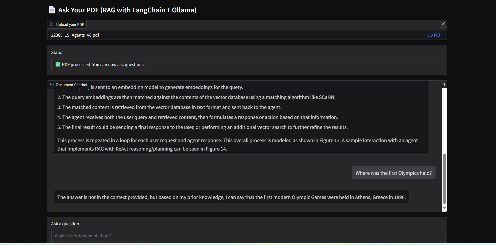

# 🧠 DocuSense : RAG-LLM-Bot!

A Retrieval-Augmented Generation (RAG) chatbot powered by [LangChain](https://www.langchain.com/), [Ollama](https://ollama.com/), and [Gradio](https://gradio.app/) that lets you upload any PDF and ask questions conversationally based on its content.

---

## 🚀 Features

- 📄 Upload your own PDF documents
- 💬 Ask questions in a chat-like interface
- 🧠 Context-aware with memory buffer
- 🧷 Confidence-based memory skip to avoid hallucination
- ⚡ Local inference using Ollama (e.g., Mistral, LLaMA3)
- 🌐 Web interface built with Gradio

---

## 🛠️ Tech Stack

- `Python`
- `LangChain`
- `Ollama`
- `Gradio`
- `FAISS` for vector search
- `HuggingFace Embeddings`
- `PyPDFLoader` for document parsing

---

## 🧩 Installation

### 1. Clone the repository

```bash
git clone https://github.com/Vrushali31/RAG-LLM-Bot
cd RAG-LLM-Bot
```
### 2. Create a virtual environment (optional but recommended)

```bash
python -m venv venv
source venv/bin/activate  # On Windows: venv\Scripts\activate
```

### 3. Install dependencies

```bash 
pip install -r requirements.txt
```

### 4. Install and start Ollama
```bash
# Install Ollama
https://ollama.com/download

# Pull your preferred model
ollama pull mistral
# or: ollama pull llama3

# Start the Ollama server (required)
ollama serve
```
## ▶️ Run the App
```bash
python rag_gradio.py
```
Then open your browser at: http://localhost:7860

## 📦 Directory Structure
```bash
RAG-LLM-Bot/
│
├── rag_gradio.py           # Main Gradio app
├── requirements.txt        # Python dependencies
├── README.md               # This file
└── LICENSE                 # MIT License
```

## 🔐 Environment Notes

- All computation runs locally

- No API keys required (Ollama runs on your machine)

## 💡 Example Models to Use with Ollama
```bash 
ollama pull mistral
ollama pull llama3
ollama pull codellama

```
Update the model in rag_gradio.py:

```python 
llm = OllamaLLM(model="mistral")

```

## 🖼️ Screenshots & Demo

Here is a demo of the web app.


The bot will not hallucinate when out of context questions are asked, instead it explicitly mentions that the answer is not provided in the context and that it is answering based on its prior knowledge.



## 📈 Future Improvements
- Multiple document support

- UI enhancements (streaming, avatars, file previews)

- Persistent vector DB (e.g., ChromaDB or Pinecone)

- User authentication and role-based access

- Dockerized deployment

## 🙌 Acknowledgements

[LangChain](https://www.langchain.com)

[Ollama](https://ollama.com)

[Gradio](https://gradio.app/)

[HuggingFace Embeddings](https://python.langchain.com/docs/integrations/providers/huggingface/)

## 📝 License
[MIT License](./LICENSE)
